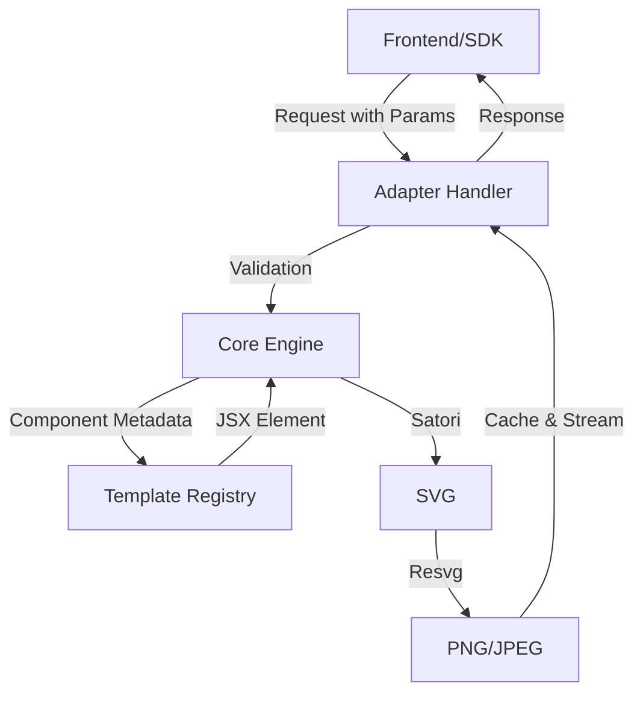

# og-engine 🖼️

**The high-performance, platform-agnostic social image engine.**  
Build, preview, and deploy social images that look handcrafted—at the speed of the edge.

[](https://www.npmjs.com/package/@og-engine/core)
[](LICENSE)
[](https://github.com/og-engine/og-engine/actions)
[](https://bundlephobia.com/package/@og-engine/sdk)

---

## ✨ What is it?

`og-engine` is an open-source framework for generating dynamic social meta tags and Open Graph images. Unlike generic generators, it focuses on **premium typography**, **flexible templates**, and **zero-dependency SDKs**.

- 🚀 **Edge-Ready**: Optimized for Cloudflare Workers, Vercel Edge, and Node.js.
- 🎨 **Satori Powered**: Uses JSX-to-SVG for high-fidelity rendering.
- 🛠️ **Fully Typed**: 100% TypeScript with generated schemas for every template.
- 📦 **Zero-Dep SDK**: A 2kB SDK to build complex URLs in your frontend.

---

## ⚙️ How it Works

`og-engine` decouples the **design** (templates) from the **infrastructure** (adapters).



### The 3 Pillars:
1.  **Templates**: Pure JSX components paired with a JSON schema. Templates are now flattened into single files for maximum portability.
2.  **Core**: The central processing unit. It coordinates parameter coercion, font loading, SVG generation (via Satori), and final image encoding.
3.  **Adapters**: Lightweight abstractions that bridge the Core to specific environments like Cloudflare R2/KV or Node.js.

---

## 🚀 Quick Start

Generate a stunning social image with a simple GET request:

```bash
# Get a sunset-themed OG image
curl "https://og.yourdomain.com/api/og?template=sunset&title=Hello+World" --output og.png
```

### Or using the SDK in your app:

```typescript
import { buildOgUrl } from '@og-engine/sdk';

const url = buildOgUrl('https://og.yourdomain.com', {
  template: 'sunset',
  size: 'twitter-og',
  params: {
    title: 'Designing at the Edge',
    author: '@aarav'
  }
});
```

---

## 🎨 Built-in Templates

| Sunset Editorial | Minimal Swiss | Dark Terminal |
| :--- | :--- | :--- |
|  |  |  |

---

## 📐 Platform Sizes

| Platform | Size | Ratio |
| :--- | :--- | :--- |
| **Twitter / X** | 1200 × 628 | 1.91:1 |
| **Instagram Post** | 1080 × 1080 | 1:1 |
| **LinkedIn** | 1200 × 627 | 1.91:1 |
| **Discord** | 1280 × 640 | 2:1 |
| **Generic OG** | 1200 × 630 | 1.91:1 |

---

## 🏠 Self-Hosting

The engine can be deployed as a standard Next.js application or integrated into existing Node/Cloudflare environments using our adapters.

```bash
pnpm install
pnpm build
pnpm start
```

---

## 📦 Packages

| Package | Description | Version |
| :--- | :--- | :--- |
| [`@og-engine/sdk`](./packages/sdk) | Zero-dependency URL builder |  |
| [`@og-engine/core`](./packages/core) | Shared rendering logic |  |
| [`@og-engine/types`](./packages/types) | Shared TS types |  |
| [`@og-engine/adapter-node`](./packages/adapter-node) | Node.js adapter |  |
| [`@og-engine/adapter-cloudflare`](./packages/adapter-cloudflare) | Cloudflare adapter |  |

---

## 🤝 Contributing

We love new templates! Please see [CONTRIBUTING.md](./CONTRIBUTING.md) for the guide on how to build and submit your own designs.

## 📄 License

MIT © [og-engine](https://github.com/og-engine)
